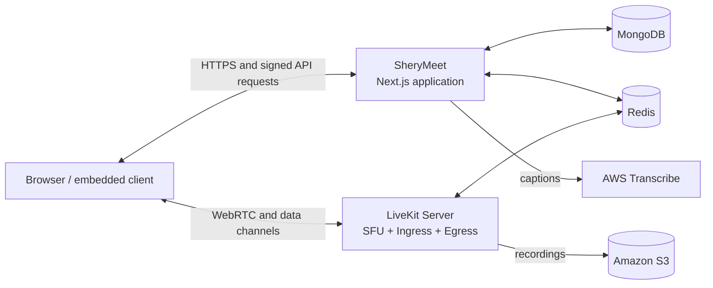

<div align="center">

# 🎥 SheryMeet

### An open-source video conferencing and webinar platform powered by LiveKit

Host secure meetings, moderate participants, stream reactions and chat, record sessions, and embed the experience in your own product.

[](https://nextjs.org/)
[](https://react.dev/)
[](https://livekit.io/)
[](https://www.typescriptlang.org/)
[](#deployment-option-2-deploy-the-complete-stack-on-aws)
[](./Dockerfile)

[Features](#features) · [Run locally](#run-sherymeet-locally) · [Deploy LiveKit only](#deployment-option-1-deploy-livekit-on-aws-and-run-sherymeet-locally) · [Deploy everything](#deployment-option-2-deploy-the-complete-stack-on-aws) · [LiveKit docs](#livekit-and-sdk-documentation)

</div>

---

## What is SheryMeet?

SheryMeet is a self-hostable conference application built for video meetings and webinar-style events. The web application handles meeting workflows, participant roles, moderation, chat, transcription, and recording. [LiveKit](https://livekit.io/) provides the real-time media layer for audio, video, screen sharing, data messages, ingress, and egress.

You can use SheryMeet as a standalone conferencing service or integrate it into another application through its signed server API. See [client_api_documentation.md](./client_api_documentation.md) for the API contract.

## Features

- 🎙️ Real-time audio and video rooms
- 🖥️ Screen sharing and responsive meeting layouts
- 👥 Host, co-host, panelist, and participant roles
- 🛡️ Host moderation: mute, ask to unmute, change publishing access, and remove participants
- 💬 Public chat, private messages to hosts, global chat lock, and host-configured slow mode
- 🎉 Floating emoji reactions and hand raising
- 📝 Live transcription and caption overlay
- ⏺️ LiveKit Egress recording to Amazon S3
- 📡 LiveKit Ingress support for external streams
- 🔐 HMAC-authenticated server API, replay protection, rate limiting, and audit logs
- 🧩 Embeddable meeting flow for integration into another product
- 🐳 Production Docker image and AWS provisioning scripts

## Architecture



### Technology

| Area                                | Technology                                     |
| ----------------------------------- | ---------------------------------------------- |
| Web application                     | Next.js 16, React 19, TypeScript, Tailwind CSS |
| Real-time media                     | LiveKit client and server SDKs                 |
| Application data                    | MongoDB with Mongoose                          |
| Rate limiting and replay protection | Redis                                          |
| Transcription and recording storage | AWS Transcribe and Amazon S3                   |
| Deployment                          | Docker, EC2, ECR, Secrets Manager, Caddy       |

## Choose a deployment

| Goal                                                                   | Use this path                                                                                                                    |
| ---------------------------------------------------------------------- | -------------------------------------------------------------------------------------------------------------------------------- |
| Develop SheryMeet locally while using your own AWS-hosted media server | [Deploy LiveKit only](#deployment-option-1-deploy-livekit-on-aws-and-run-sherymeet-locally)                                      |
| Run the SheryMeet application and LiveKit infrastructure on AWS        | [Deploy the complete stack](#deployment-option-2-deploy-the-complete-stack-on-aws)                                               |
| Use LiveKit Cloud instead of managing a media server                   | Create a LiveKit Cloud project, copy its URL/key/secret into `.env`, then follow [Run SheryMeet locally](#run-sherymeet-locally) |

## Prerequisites

### Local development

- Node.js 20+
- [pnpm](https://pnpm.io/installation)
- MongoDB 6+
- Redis 7+
- A LiveKit Cloud project or a self-hosted LiveKit server

### AWS scripts

- A Bash environment such as Linux, macOS, or WSL
- [AWS CLI v2](https://docs.aws.amazon.com/cli/latest/userguide/getting-started-install.html), authenticated with `aws configure` or an IAM role
- `jq`
- Docker for building and pushing the application image
- An existing VPC, with a `Name` tag, containing at least one subnet that can assign/reach public IPs
- Control of the DNS zones used by the LiveKit and SheryMeet domains
- An externally reachable MongoDB deployment, such as MongoDB Atlas, for the full AWS setup
- An existing S3 bucket and AWS credentials with the permissions required by recording/transcription features

> [!IMPORTANT]
> The included scripts create EC2 instances, security groups, an ECR repository, an IAM role/profile, and a Secrets Manager secret. They do **not** create the VPC, subnet, DNS records, MongoDB deployment, or S3 bucket.

## Run SheryMeet locally

### 1. Clone and install

```bash
git clone https://github.com/gouravrajak985/sherymeet.git
cd sherymeet
pnpm install
```

### 2. Start MongoDB and Redis

Use services already installed on your machine, or start development containers:

```bash
docker run -d --name sherymeet-mongo -p 27017:27017 mongo:6
docker run -d --name sherymeet-redis -p 6379:6379 redis:7
```

### 3. Configure the application

```bash
cp .env.example .env
```

Keep only the application variables in `.env`; the deployment example at the bottom of `.env.example` belongs in the separate `.env.deploy` file.

Fill in the application section of `.env`:

```dotenv
NODE_ENV=development

LIVEKIT_URL=wss://livekit.example.com
LIVEKIT_API_KEY=replace_me
LIVEKIT_API_SECRET=replace_me
NEXT_PUBLIC_LIVEKIT_URL=wss://livekit.example.com
NEXT_PUBLIC_API_URL=http://localhost:3000

MONGODB_URI=mongodb://localhost:27017/sherymeet
REDIS_URL=redis://localhost:6379
ENCRYPTION_MASTER_KEY=replace_with_at_least_32_random_characters

AWS_ACCESS_KEY_ID=replace_me
AWS_SECRET_ACCESS_KEY=replace_me
AWS_REGION=ap-south-1
AWS_TRANSCRIBE_REGION=ap-south-1
AWS_S3_REGION=ap-south-1
AWS_S3_BUCKET_NAME=replace_me
```

The AWS values are used for transcription and recording. The complete list, including optional settings, is documented in [`.env.example`](./.env.example).

### 4. Start the app

```bash
pnpm dev
```

Open [http://localhost:3000](http://localhost:3000).

### 5. Create an API client

Create a client when integrating SheryMeet with another backend:

```bash
pnpm create-client -- --name "My Backend" --domain localhost --allow-recording
```

The command prints the client secret once. Store it securely and use it to sign requests described in [client_api_documentation.md](./client_api_documentation.md).

## AWS deployment files

All AWS scripts live in [`.deployinfra/aws`](./.deployinfra/aws). Run them from the repository root.

| Script       | Purpose                                                                      |
| ------------ | ---------------------------------------------------------------------------- |
| `csg.sh`     | Creates the LiveKit, Redis, and SheryMeet security groups                    |
| `rd.sh`      | Creates a Redis 7 EC2 instance with password authentication                  |
| `lk.sh`      | Creates a LiveKit EC2 instance with Ingress, Egress, and Caddy               |
| `aws.ecr.sh` | Builds the SheryMeet image, creates the ECR repository, and pushes the image |
| `secrets.sh` | Copies the application `.env` into AWS Secrets Manager                       |
| `sm.sh`      | Creates the SheryMeet EC2 instance and runs the image behind Caddy           |
| `destroy.sh` | Removes the EC2/security-group infrastructure created by the scripts         |

> [!CAUTION]
> `destroy.sh` deletes cloud resources. Review it and confirm the configured names and AWS region before running it.

## Deployment option 1: Deploy LiveKit on AWS and run SheryMeet locally

Use this mode when developing the web application locally while the LiveKit media services run on AWS.

### 1. Create `.env.deploy`

Create `.env.deploy` in the repository root. These values are examples:

```dotenv
AWS_REGION=ap-south-2
AWS_VPC_NAME=your-existing-vpc-name

LIVEKIT_SECURITY_GROUP_NAME=sherymeet-livekit-sg
SHERYMEET_SECURITY_GROUP_NAME=sherymeet-app-sg
REDIS_SECURITY_GROUP_NAME=sherymeet-redis-sg

REDIS_INSTANCE_TYPE=t3.large
REDIS_INSTANCE_NAME=sherymeet-redis
REDIS_PASSWORD=replace_with_a_long_random_password

LIVEKIT_DOMAIN=livekit.example.com
LIVEKIT_TURN_DOMAIN=turn.example.com
LIVEKIT_WHIP_DOMAIN=whip.example.com
LIVEKIT_WEBHOOK_DOMAIN=webhook.example.com
LIVEKIT_INSTANCE_TYPE=t3.large
LIVEKIT_INSTANCE_NAME=sherymeet-livekit
```

Keep `.env.deploy` private. It is already excluded from Git.

### 2. Create the network rules and Redis

```bash
bash .deployinfra/aws/csg.sh
bash .deployinfra/aws/rd.sh
```

The Redis security group accepts port `6379` only from the LiveKit and SheryMeet security groups. Its printed public URL will therefore not be reachable from an ordinary local machine. Use a separate local Redis instance for local SheryMeet development.

### 3. Deploy LiveKit

```bash
bash .deployinfra/aws/lk.sh
```

The script deploys:

- LiveKit Server
- LiveKit Ingress
- LiveKit Egress
- Caddy for TLS termination

At completion, it prints the LiveKit public IP, WebSocket URL, API key, and API secret. Save the key and secret immediately.

### 4. Configure DNS

Create `A` records pointing these hostnames to the printed LiveKit public IP:

- `LIVEKIT_DOMAIN`
- `LIVEKIT_TURN_DOMAIN`
- `LIVEKIT_WHIP_DOMAIN`
- `LIVEKIT_WEBHOOK_DOMAIN`

Caddy can obtain TLS certificates after the records resolve. Production camera and microphone access also requires HTTPS/WSS.

### 5. Connect local SheryMeet

Copy the generated LiveKit values into the local `.env`:

```dotenv
LIVEKIT_URL=wss://livekit.example.com
NEXT_PUBLIC_LIVEKIT_URL=wss://livekit.example.com
LIVEKIT_API_KEY=the_key_printed_by_lk_sh
LIVEKIT_API_SECRET=the_secret_printed_by_lk_sh

NEXT_PUBLIC_API_URL=http://localhost:3000
MONGODB_URI=mongodb://localhost:27017/sherymeet
REDIS_URL=redis://localhost:6379
```

Then run:

```bash
pnpm dev
```

> [!NOTE]
> An AWS-hosted webhook cannot call `localhost`. Basic meetings will work, but webhook-dependent state such as recording updates needs a publicly reachable HTTPS endpoint or a development tunnel.

## Deployment option 2: Deploy the complete stack on AWS

This path runs Redis, LiveKit, and the SheryMeet application on EC2. It stores the application image in ECR and runtime configuration in Secrets Manager.

### 1. Prepare configuration

Copy the application environment template:

```bash
cp .env.example .env
```

Configure `.env` for production. In particular:

- Set `NODE_ENV=production`.
- Use the final `https://` SheryMeet URL for `NEXT_PUBLIC_API_URL`.
- Use the final `wss://` LiveKit URL for `LIVEKIT_URL` and `NEXT_PUBLIC_LIVEKIT_URL`.
- Set `MONGODB_URI` to a database reachable from the application EC2 instance.
- After Redis is created, set `REDIS_URL` with its **private** IP and password.
- Configure AWS Transcribe and S3 values.
- Generate a strong `ENCRYPTION_MASTER_KEY` of at least 32 characters.

Create `.env.deploy` using the values from option 1 plus:

```dotenv
IAM_PROFILE_NAME=SheryMeetEC2Profile
IAM_ROLE_NAME=SheryMeetEC2Role

AWS_ECR_IMAGE=123456789012.dkr.ecr.ap-south-1.amazonaws.com/sherymeet-app:latest
# secrets.sh reads this name when it creates or updates the secret
AWS_SECRET_MANAGER_NAME=sherymeet/app
# sm.sh reads this name when the application instance fetches the secret
SHERYMEET_SECRET_MANAGER_NAME=sherymeet/app
SHERYMEET_DOMAIN=meet.example.com
SHERYMEET_INSTANCE_TYPE=t3.large
SHERYMEET_INSTANCE_NAME=sherymeet-app
```

### 2. Provision security groups, Redis, and LiveKit

Run the scripts in order:

```bash
bash .deployinfra/aws/csg.sh
bash .deployinfra/aws/rd.sh
bash .deployinfra/aws/lk.sh
```

After they finish:

1. Point all LiveKit DNS records to the LiveKit public IP.
2. Put the generated LiveKit URL, key, and secret in `.env`.
3. Find the Redis instance's private IP in EC2 and set:

```dotenv
REDIS_URL=redis://:your_password@10.0.0.10:6379
```

### 3. Build and push SheryMeet

```bash
bash .deployinfra/aws/aws.ecr.sh
```

The script creates the `sherymeet-app` ECR repository if needed, builds the Docker image, and pushes `latest` plus a Git commit tag.

> [!NOTE]
> `aws.ecr.sh` currently sets its region near the top of the script and defaults to `ap-south-1`. Change that value before running the script if your infrastructure uses another region. The `NEXT_PUBLIC_*` values are compiled into the browser bundle, so make sure they are final before building.

Copy the printed image URI, including `:latest`, into `AWS_ECR_IMAGE` in `.env.deploy`.

### 4. Store the application environment

```bash
bash .deployinfra/aws/secrets.sh
```

This uploads every non-commented value from `.env` to the secret named by `AWS_SECRET_MANAGER_NAME`. Keep `AWS_SECRET_MANAGER_NAME` and `SHERYMEET_SECRET_MANAGER_NAME` identical so the application instance reads the same secret that this step writes.

### 5. Deploy the SheryMeet application

```bash
bash .deployinfra/aws/sm.sh
```

The script creates the EC2 IAM role/profile, gives the instance read access to ECR and the configured secret, pulls the image, and starts SheryMeet behind Caddy.

When it finishes:

1. Point `SHERYMEET_DOMAIN` to the printed application public IP.
2. Wait for DNS propagation and Caddy certificate issuance.
3. Check `https://<SHERYMEET_DOMAIN>/api/health`.

### 6. Create the integration client

Run the client command from a trusted environment that can reach the production MongoDB instance:

```bash
pnpm create-client -- --name "Production Backend" --domain app.example.com --allow-recording
```

Save the generated secret in the integrating backend; never expose it in browser code.

## LiveKit and SDK documentation

SheryMeet uses LiveKit as its media server and uses both LiveKit JavaScript SDKs:

- [`livekit-client`](https://docs.livekit.io/reference/client-sdk-js/) runs in the browser. It manages rooms, local/remote participants, tracks, data messages, device access, and WebRTC events.
- [`livekit-server-sdk`](https://docs.livekit.io/reference/server-sdk-js/) runs in the SheryMeet backend. It creates signed access tokens and performs room administration, participant permission changes, ingress, and egress operations.

Read these LiveKit guides before changing authentication, permissions, media transport, moderation, or deployment:

- [LiveKit documentation](https://docs.livekit.io/)
- [Authentication](https://docs.livekit.io/home/concepts/authentication/)
- [Tokens, grants, and permissions](https://docs.livekit.io/home/server/generating-tokens/)
- [Self-hosting LiveKit](https://docs.livekit.io/transport/self-hosting/)
- [Ingress](https://docs.livekit.io/transport/media/ingress-egress/ingress/)
- [Egress and recording](https://docs.livekit.io/transport/media/ingress-egress/egress/)

> [!WARNING]
> Keep `LIVEKIT_API_SECRET` on the server. Participant access tokens should be minted by a trusted backend with the smallest grants required for that role.

## Useful commands

```bash
pnpm dev           # start the development server
pnpm build         # create a production build
pnpm start         # run the production build
pnpm lint          # run ESLint
pnpm format:check  # check formatting
```

## Security checklist

- Never commit `.env` or `.env.deploy`.
- Restrict AWS IAM policies and rotate credentials regularly.
- Keep MongoDB, Redis, LiveKit API secrets, and integration secrets out of client-side code.
- Use HTTPS/WSS and trusted DNS names in production.
- Review EC2 security-group ingress rules and restrict SSH access to trusted IP ranges.
- Use long random Redis and encryption keys.

## Contributing

Ideas, bug reports, and pull requests are welcome. When changing LiveKit behavior, include the SDK behavior or LiveKit grant involved in the pull request description. Before opening a pull request, run:

```bash
pnpm lint
pnpm build
```

Please report security-sensitive issues privately instead of opening a public issue with credentials or exploit details.

---

<div align="center">
Built for teams that want control over their conferencing stack. 🚀
</div>
